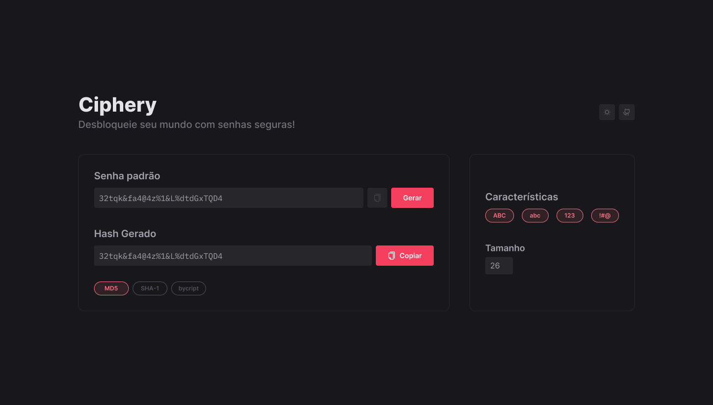

<h1>Ciphery</h1>

Gere senhas e criptografe-as utilizando diversos algoritmos de criptografia.

<h4>Tela principal</h4>

<h4>Tecnologias</h4>
<ul>
<li>Javascript</li>
<li>Typescript</li>
<li>React.js</li>
<li>Next.js</li>
<li>Styled-components</li>
</ul>
<h4>Uso</h4>
<ol>
<li>Configure os parâmetros para gerar a senha. Você pode escolher os elementos que irão compor sua senha, tais como: letras maiúsculas, minúsculas, números e símbolos.</li>
<li>Após configurar os parâmetros, clique no botão gerar senha, e a mesma será gerada automaticamente. o conteúdo do campo pode ser editável, o que te permite fazer ajustes na senha, se necessário. Além disso, haverá um botão para você poder copiar a senha a área de transferência.</li>
<li>Escolha o algoritmo de criptografia a ser utilizado, podendo selecionar entre MD5, SHA-1 e Highway. O campo de texto é apenas de leitura. Ao lado, há um botão para copiar o conteúdo para a área de trabalho.</li>
</ol>

<h4>Licença</h4>

Este projeto é distribuído sob a licença MIT. Consulte o arquivo <a href='LICENSE'>LICENSE</a> para obter mais informações.
